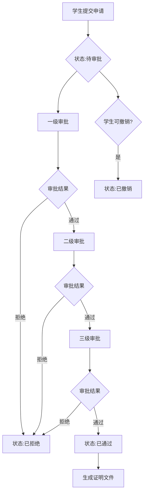

# 研究生学术认证系统 - 详细技术文档

## 一、项目概述

### 1.1 项目简介
研究生学术认证系统是一个为高校研究生提供在线申请和管理各类学术证明的数字化平台。系统实现了学生在线申请、教师分级审批、管理员统一管理的完整业务闭环。

### 1.2 技术架构

#### 后端技术栈
- **开发框架**: Spring Boot 2.x
- **持久层框架**: MyBatis-Plus
- **数据库**: MySQL 8.0
- **缓存**: Redis
- **身份认证**: JWT (JSON Web Token)
- **构建工具**: Maven
- **服务端口**: 8080

#### 前端技术栈
- **开发框架**: Vue 3 (Composition API)
- **开发语言**: TypeScript
- **构建工具**: Vite
- **UI组件库**: Element Plus
- **状态管理**: Pinia
- **路由管理**: Vue Router
- **HTTP客户端**: Axios
- **开发端口**: 5173

### 1.3 系统角色
- **学生**: 提交证明申请、查看申请进度、下载证明文件
- **教师**: 审批学生申请、查看审批记录、管理学生信息
- **管理员**: 系统配置、模板管理、用户管理、数据统计

---

## 二、业务流程

### 2.1 用户认证流程

```
┌─────────┐         ┌─────────────┐         ┌──────────┐
│  用户   │─登录请求→│   后端API   │─验证密码→│  数据库  │
└─────────┘         └─────────────┘         └──────────┘
     │                      │
     │                      ├─生成JWT Token
     │                      │
     │                      ├─保存用户信息到Redis
     │                      │
     │←────返回Token────────┤
     │                      
     ├─携带Token访问API
     │                      
     └─────────────────────→│
                            │
                            ├─验证Token有效性
                            │
                            ├─从Redis获取用户信息
                            │
                            └─返回业务数据
```

**流程说明**:
1. 用户提交用户名和密码
2. 后端验证用户凭证（使用BCrypt加密算法）
3. 验证成功后生成JWT Token（有效期7天）
4. 将用户信息缓存到Redis
5. 前端保存Token到localStorage
6. 后续请求在Header中携带Token: `Authorization: Bearer <token>`
7. 后端拦截器验证Token并注入用户上下文

### 2.2 证明申请流程

```
┌──────┐    ┌──────────┐    ┌──────────┐    ┌──────────┐
│ 学生 │───→│ 提交申请 │───→│ 教师审批 │───→│ 生成证明 │
└──────┘    └──────────┘    └──────────┘    └──────────┘
                │                 │                │
                ↓                 ↓                ↓
            保存申请         分级审批流程      证明文件生成
            状态:待审批      状态:审批中       状态:已通过
                                │
                                ├─初审(一级)
                                │
                                ├─复审(二级)
                                │
                                └─终审(三级)
```

**申请状态流转**:
```
待审批(0) → 审批中(1) → 已通过(2) ✓
    ↓           ↓           
  已撤销(4)   已拒绝(3) ✗
```

**详细步骤**:
1. **学生提交申请**
   - 选择证明类型（在读证明、成绩单、毕业证明、学位证明）
   - 填写申请理由（可选）
   - 系统生成唯一申请编号
   - 初始状态：待审批(0)

2. **教师审批**
   - 系统根据教师审批级别自动分配待审批列表
   - 教师查看申请详情和学生信息
   - 提交审批意见：通过/拒绝
   - 记录审批时间和审批意见
   - 状态变更：待审批 → 审批中

3. **分级审批**
   - 一级审批（初审）：辅导员/班主任
   - 二级审批（复审）：学院教务
   - 三级审批（终审）：研究生院
   - 每级审批通过后自动流转到下一级
   - 任一级拒绝则整体拒绝

4. **证明生成**
   - 所有审批通过后状态变更为已通过(2)
   - 系统根据模板生成证明文件
   - 记录证明编号和开具日期
   - 学生可下载查看证明

### 2.3 审批流程详解



---

## 三、API接口文档

### 3.1 通用说明

**Base URL**: `http://localhost:8080/api`

**请求头**:
```http
Content-Type: application/json
Authorization: Bearer <JWT_TOKEN>
```

**统一响应格式**:
```json
{
  "code": 200,
  "message": "操作成功",
  "data": {},
  "timestamp": "2026-01-22 13:30:00"
}
```

**状态码说明**:
- 200: 成功
- 400: 请求参数错误
- 401: 未授权（未登录或Token失效）
- 403: 无权限访问
- 404: 资源不存在
- 500: 服务器内部错误

---

### 3.2 认证模块 (/api/auth)

#### 3.2.1 用户登录
**接口**: `POST /api/auth/login`

**描述**: 用户登录，返回JWT Token和用户信息

**请求参数**:
```json
{
  "username": "202101001",
  "password": "123456"
}
```

**响应示例**:
```json
{
  "code": 200,
  "message": "登录成功",
  "data": {
    "token": "eyJhbGciOiJIUzUxMiJ9...",
    "userInfo": {
      "userId": "U2025000001",
      "username": "202101001",
      "realName": "张三",
      "userType": 1,
      "studentId": "S2021000001",
      "email": "zhangsan@example.com"
    }
  }
}
```

#### 3.2.2 用户注册
**接口**: `POST /api/auth/register`

**描述**: 新用户注册（学生/教师）

**请求参数**:
```json
{
  "username": "202101001",
  "password": "123456",
  "realName": "张三",
  "userType": 1,
  "email": "zhangsan@example.com",
  "phone": "13800138000",
  "studentNo": "202101001"
}
```

**字段说明**:
- `userType`: 1-学生, 2-教师
- `studentNo`: 学生注册时必填
- `teacherNo`: 教师注册时必填

**响应示例**:
```json
{
  "code": 200,
  "message": "注册成功"
}
```

---

### 3.3 证明申请模块 (/api/application)

#### 3.3.1 提交申请
**接口**: `POST /api/application`

**描述**: 学生提交证明申请

**请求头**: 需要JWT Token

**请求参数**:
```json
{
  "pkCt": "CT2025000001",
  "certificateType": "在读证明",
  "applicationReason": "出国留学需要",
  "copies": 2,
  "urgent": 0
}
```

**响应示例**:
```json
{
  "code": 200,
  "message": "申请提交成功",
  "data": {
    "pkCa": "CA2025000123",
    "applicationNo": "APP20250122001",
    "certificateType": "在读证明",
    "status": 0,
    "statusText": "待审批",
    "createTime": "2026-01-22 13:30:00"
  }
}
```

#### 3.3.2 查询我的申请列表
**接口**: `GET /api/application/my`

**描述**: 学生查询自己的申请记录

**请求参数** (Query):
- `current`: 当前页码，默认1
- `size`: 每页条数，默认10
- `status`: 申请状态筛选（可选）

**请求示例**:
```
GET /api/application/my?current=1&size=10&status=0
```

**响应示例**:
```json
{
  "code": 200,
  "message": "成功",
  "data": {
    "records": [
      {
        "pkCa": "CA2025000123",
        "applicationNo": "APP20250122001",
        "certificateType": "在读证明",
        "status": 0,
        "statusText": "待审批",
        "applicationReason": "出国留学需要",
        "createTime": "2026-01-22 13:30:00",
        "updateTime": "2026-01-22 13:30:00"
      }
    ],
    "total": 15,
    "size": 10,
    "current": 1,
    "pages": 2
  }
}
```

#### 3.3.3 撤销申请
**接口**: `PUT /api/application/{pkCa}/cancel`

**描述**: 学生撤销待审批的申请

**路径参数**:
- `pkCa`: 申请ID

**响应示例**:
```json
{
  "code": 200,
  "message": "申请已撤销"
}
```

#### 3.3.4 查询申请详情
**接口**: `GET /api/application/{pkCa}`

**描述**: 查询申请的详细信息

**路径参数**:
- `pkCa`: 申请ID

**响应示例**:
```json
{
  "code": 200,
  "message": "成功",
  "data": {
    "pkCa": "CA2025000123",
    "applicationNo": "APP20250122001",
    "studentName": "张三",
    "studentNo": "202101001",
    "certificateType": "在读证明",
    "applicationReason": "出国留学需要",
    "status": 1,
    "statusText": "审批中",
    "currentApprovalLevel": 2,
    "createTime": "2026-01-22 13:30:00",
    "approvalRecords": [
      {
        "approverName": "李老师",
        "approvalLevel": 1,
        "approvalResult": 1,
        "approvalOpinion": "同意",
        "approvalTime": "2026-01-22 14:00:00"
      }
    ]
  }
}
```

#### 3.3.5 查询待审批列表（教师）
**接口**: `GET /api/application/pending`

**描述**: 教师查询待自己审批的申请列表

**请求参数** (Query):
- `current`: 当前页码
- `size`: 每页条数

**响应示例**:
```json
{
  "code": 200,
  "message": "成功",
  "data": {
    "records": [
      {
        "pkCa": "CA2025000123",
        "applicationNo": "APP20250122001",
        "studentName": "张三",
        "studentNo": "202101001",
        "certificateType": "在读证明",
        "status": 0,
        "createTime": "2026-01-22 13:30:00"
      }
    ],
    "total": 5,
    "current": 1,
    "pages": 1
  }
}
```

#### 3.3.6 获取证明详情
**接口**: `GET /api/application/{pkCa}/detail`

**描述**: 获取完整的证明详情（包含学生信息和模板信息）

#### 3.3.7 获取学生统计数据
**接口**: `GET /api/application/statistics/student`

**描述**: 学生查看自己的申请统计

**响应示例**:
```json
{
  "code": 200,
  "message": "成功",
  "data": {
    "totalApplications": 10,
    "pendingCount": 2,
    "approvedCount": 7,
    "rejectedCount": 1
  }
}
```

#### 3.3.8 获取教师统计数据
**接口**: `GET /api/application/statistics/teacher`

**描述**: 教师查看待审批统计

#### 3.3.9 获取可用模板列表
**接口**: `GET /api/application/templates`

**描述**: 获取所有可用的证明模板

---

### 3.4 审批模块 (/api/approval)

#### 3.4.1 处理审批
**接口**: `POST /api/approval`

**描述**: 教师提交审批意见

**请求头**: 需要JWT Token（教师权限）

**请求参数**:
```json
{
  "pkCa": "CA2025000123",
  "approvalResult": 1,
  "approvalOpinion": "学生信息核实无误，同意通过"
}
```

**字段说明**:
- `approvalResult`: 0-拒绝, 1-通过
- `approvalOpinion`: 审批意见（拒绝时必填）

**响应示例**:
```json
{
  "code": 200,
  "message": "审批操作成功"
}
```

---

### 3.5 学生信息模块 (/api/student)

#### 3.5.1 获取当前学生信息
**接口**: `GET /api/student/current`

**描述**: 学生查看自己的详细信息

**响应示例**:
```json
{
  "code": 200,
  "message": "成功",
  "data": {
    "pkStudent": "S2021000001",
    "studentNo": "202101001",
    "name": "张三",
    "gender": 1,
    "college": "计算机学院",
    "major": "计算机科学与技术",
    "grade": "2021",
    "enrollmentDate": "2021-09-01",
    "graduationDate": "2024-06-30",
    "educationLevel": "硕士",
    "studyType": "全日制",
    "graduationStatus": 0
  }
}
```

#### 3.5.2 更新学生信息
**接口**: `PUT /api/student`

**描述**: 学生更新自己的信息

#### 3.5.3 根据学号查询
**接口**: `GET /api/student/studentNo/{studentNo}`

#### 3.5.4 分页查询学生（管理员）
**接口**: `GET /api/student/page`

**请求参数** (Query):
- `current`: 页码
- `size`: 每页条数
- `college`: 学院（可选）
- `major`: 专业（可选）
- `graduationStatus`: 毕业状态（可选）

---

### 3.6 教师信息模块 (/api/teacher)

#### 3.6.1 获取当前教师信息
**接口**: `GET /api/teacher/current`

**描述**: 教师查看自己的详细信息

**响应示例**:
```json
{
  "code": 200,
  "message": "成功",
  "data": {
    "pkTeacher": "T2020000001",
    "teacherNo": "T001",
    "name": "李老师",
    "gender": 1,
    "college": "计算机学院",
    "department": "软件工程系",
    "position": "副教授",
    "approvalLevel": 1
  }
}
```

#### 3.6.2 更新教师信息
**接口**: `PUT /api/teacher`

#### 3.6.3 根据工号查询
**接口**: `GET /api/teacher/teacherNo/{teacherNo}`

#### 3.6.4 分页查询教师（管理员）
**接口**: `GET /api/teacher/page`

---

### 3.7 管理员模块 (/api/admin)

#### 3.7.1 模板管理

**查询模板列表**
```
GET /api/admin/templates?current=1&size=10
```

**创建模板**
```
POST /api/admin/templates
{
  "templateName": "在读证明",
  "templateType": "enrollment",
  "templateContent": "证明模板内容...",
  "status": 1
}
```

**更新模板**
```
PUT /api/admin/templates
{
  "pkCt": "CT2025000001",
  "templateName": "在读证明（更新）",
  "status": 1
}
```

**删除模板**
```
DELETE /api/admin/templates/{pkCt}
```

#### 3.7.2 学生管理

**查询学生列表**
```
GET /api/admin/students?current=1&size=10&college=计算机学院
```

#### 3.7.3 教师管理

**查询教师列表**
```
GET /api/admin/teachers?current=1&size=10&approvalLevel=1
```

#### 3.7.4 统计数据

**获取全局统计**
```
GET /api/admin/statistics
```

**响应示例**:
```json
{
  "code": 200,
  "data": {
    "totalStudents": 1520,
    "totalTeachers": 85,
    "totalApplications": 3240,
    "pendingApprovals": 45,
    "todayApplications": 12
  }
}
```

#### 3.7.5 全站申请记录

**查询所有申请**
```
GET /api/admin/applications?current=1&size=20&status=2
```

---

## 四、数据库设计

### 4.1 数据库ER图（简化版）

```
┌─────────────┐         ┌─────────────┐         ┌─────────────┐
│  sys_user   │────1:1──│student_info │         │teacher_info │
│（系统用户）  │         │ （学生信息） │         │ （教师信息） │
└─────────────┘         └─────────────┘         └─────────────┘
       │                       │                       │
       │                       │                       │
       │                       │1:N                  N:1│
       │                       ↓                       ↓
       │              ┌──────────────────┐     ┌─────────────┐
       │              │certificate_      │────→│approval_    │
       │              │application       │     │record       │
       │              │（证明申请）       │     │（审批记录）  │
       │              └──────────────────┘     └─────────────┘
       │                       │
       │                       │N:1
       │                       ↓
       │              ┌──────────────────┐
       │              │certificate_      │
       │              │template          │
       │              │（证明模板）       │
       │              └──────────────────┘
```

### 4.2 核心表结构

#### 4.2.1 sys_user（系统用户表）

| 字段名 | 类型 | 说明 | 约束 |
|--------|------|------|------|
| pk_user | VARCHAR(20) | 用户主键（U+年份+顺序号） | PK |
| username | VARCHAR(50) | 用户名（学号/工号） | UNIQUE, NOT NULL |
| password | VARCHAR(255) | 密码（BCrypt加密） | NOT NULL |
| real_name | VARCHAR(50) | 真实姓名 | NOT NULL |
| user_type | TINYINT | 用户类型：1-学生 2-教师 3-管理员 | NOT NULL |
| email | VARCHAR(100) | 邮箱 | |
| phone | VARCHAR(20) | 手机号 | |
| avatar | VARCHAR(255) | 头像URL | |
| status | TINYINT | 账号状态：0-禁用 1-正常 | DEFAULT 1 |
| last_login_time | DATETIME | 最后登录时间 | |
| last_login_ip | VARCHAR(50) | 最后登录IP | |
| create_time | DATETIME | 创建时间 | DEFAULT CURRENT_TIMESTAMP |
| update_time | DATETIME | 更新时间 | ON UPDATE CURRENT_TIMESTAMP |

**索引**:
- PRIMARY KEY: `pk_user`
- UNIQUE KEY: `username`
- KEY: `user_type`, `status`

#### 4.2.2 student_info（学生信息表）

| 字段名 | 类型 | 说明 | 约束 |
|--------|------|------|------|
| pk_student | VARCHAR(20) | 学生主键（S+年份+顺序号） | PK |
| pk_user | VARCHAR(20) | 关联用户ID | UNIQUE, NOT NULL, FK |
| student_no | VARCHAR(30) | 学号 | UNIQUE, NOT NULL |
| name | VARCHAR(50) | 姓名 | NOT NULL |
| gender | TINYINT | 性别：0-女 1-男 | |
| id_card | VARCHAR(18) | 身份证号 | |
| college | VARCHAR(100) | 学院 | |
| major | VARCHAR(100) | 专业 | |
| class_name | VARCHAR(50) | 班级 | |
| grade | VARCHAR(10) | 年级 | |
| enrollment_date | DATE | 入学日期 | |
| graduation_date | DATE | 毕业日期 | |
| education_level | VARCHAR(20) | 学历层次：本科/硕士/博士 | |
| study_type | VARCHAR(20) | 学习形式：全日制/非全日制 | |
| graduation_status | TINYINT | 毕业状态：0-在读 1-已毕业 2-结业 | DEFAULT 0 |
| pk_teacher | VARCHAR(20) | 导师ID | FK |
| pk_department | VARCHAR(20) | 部门主键（所属系别） | |
| pk_college | VARCHAR(20) | 学院主键 | |

**索引**:
- PRIMARY KEY: `pk_student`
- UNIQUE KEY: `student_no`, `pk_user`
- KEY: `college`, `major`, `graduation_status`, `pk_teacher`

#### 4.2.3 teacher_info（教师信息表）

| 字段名 | 类型 | 说明 | 约束 |
|--------|------|------|------|
| pk_teacher | VARCHAR(20) | 教师主键（T+年份+顺序号） | PK |
| pk_user | VARCHAR(20) | 关联用户ID | UNIQUE, NOT NULL, FK |
| teacher_no | VARCHAR(30) | 工号 | UNIQUE, NOT NULL |
| name | VARCHAR(50) | 姓名 | NOT NULL |
| gender | TINYINT | 性别：0-女 1-男 | |
| college | VARCHAR(100) | 学院 | |
| department | VARCHAR(100) | 所属部门 | |
| position | VARCHAR(50) | 职称：助教/讲师/副教授/教授 | |
| approval_level | TINYINT | 审批级别：1-初审 2-复审 3-终审 | DEFAULT 1 |
| max_approval_count | INT | 最大审批数量限制 | DEFAULT 50 |

**索引**:
- PRIMARY KEY: `pk_teacher`
- UNIQUE KEY: `teacher_no`, `pk_user`
- KEY: `college`, `department`, `approval_level`

#### 4.2.4 certificate_application（证明申请表）

| 字段名 | 类型 | 说明 | 约束 |
|--------|------|------|------|
| pk_ca | VARCHAR(25) | 申请主键（CA+年份+顺序号） | PK |
| application_no | VARCHAR(50) | 申请编号（对外展示） | UNIQUE, NOT NULL |
| pk_student | VARCHAR(20) | 学生ID | NOT NULL, FK |
| pk_user | VARCHAR(20) | 学生用户ID | NOT NULL, FK |
| pk_ct | VARCHAR(20) | 证明模板ID | NOT NULL, FK |
| certificate_type | VARCHAR(50) | 证明类型 | NOT NULL |
| application_reason | VARCHAR(500) | 申请理由 | |
| application_data | TEXT | 申请数据（JSON格式） | |
| status | TINYINT | 申请状态：0-待审批 1-审批中 2-已通过 3-已拒绝 4-已撤销 | DEFAULT 0 |
| current_approval_level | TINYINT | 当前审批级别 | DEFAULT 1 |
| pk_teacher | VARCHAR(20) | 当前审批人ID | FK |
| certificate_file_url | VARCHAR(255) | 生成的证明文件URL | |
| certificate_no | VARCHAR(50) | 证明编号 | |
| issue_date | DATETIME | 开具日期 | |
| copies | INT | 申请份数 | DEFAULT 1 |
| urgent | TINYINT | 是否加急：0-否 1-是 | DEFAULT 0 |
| reject_reason | VARCHAR(500) | 拒绝原因 | |
| complete_time | DATETIME | 完成时间 | |
| create_time | DATETIME | 创建时间 | DEFAULT CURRENT_TIMESTAMP |
| update_time | DATETIME | 更新时间 | ON UPDATE CURRENT_TIMESTAMP |

**索引**:
- PRIMARY KEY: `pk_ca`
- UNIQUE KEY: `application_no`
- KEY: `pk_student`, `pk_user`, `pk_ct`, `status`, `pk_teacher`, `create_time`

**状态说明**:
- 0: 待审批
- 1: 审批中
- 2: 已通过
- 3: 已拒绝
- 4: 已撤销

#### 4.2.5 approval_record（审批记录表）

| 字段名 | 类型 | 说明 | 约束 |
|--------|------|------|------|
| pk_ar | VARCHAR(30) | 审批记录主键（AR+年份+顺序号） | PK |
| pk_ca | VARCHAR(25) | 申请ID | NOT NULL, FK |
| application_no | VARCHAR(50) | 申请编号（冗余字段） | NOT NULL |
| pk_teacher | VARCHAR(20) | 审批人ID | NOT NULL, FK |
| pk_user | VARCHAR(20) | 审批人用户ID | NOT NULL, FK |
| approver_name | VARCHAR(50) | 审批人姓名 | NOT NULL |
| approval_level | TINYINT | 审批级别：1-初审 2-复审 3-终审 | NOT NULL |
| approval_result | TINYINT | 审批结果：1-通过 2-拒绝 3-退回 | NOT NULL |
| approval_opinion | VARCHAR(500) | 审批意见 | |
| approval_time | DATETIME | 审批时间 | DEFAULT CURRENT_TIMESTAMP |
| time_cost | INT | 审批耗时（分钟） | |
| attachment_url | VARCHAR(255) | 附件URL | |
| ip_address | VARCHAR(50) | 审批IP地址 | |
| create_time | DATETIME | 创建时间 | DEFAULT CURRENT_TIMESTAMP |

**索引**:
- PRIMARY KEY: `pk_ar`
- KEY: `pk_ca`, `application_no`, `pk_teacher`, `pk_user`, `approval_level`, `approval_time`

#### 4.2.6 certificate_template（证明模板表）

| 字段名 | 类型 | 说明 | 约束 |
|--------|------|------|------|
| pk_ct | VARCHAR(20) | 模板主键（CT+年份+顺序号） | PK |
| template_name | VARCHAR(100) | 模板名称 | NOT NULL |
| template_type | VARCHAR(50) | 模板类型 | NOT NULL |
| template_content | TEXT | 模板内容 | |
| approval_levels | TINYINT | 需要审批级别数 | DEFAULT 1 |
| status | TINYINT | 状态：0-禁用 1-启用 | DEFAULT 1 |
| create_time | DATETIME | 创建时间 | DEFAULT CURRENT_TIMESTAMP |
| update_time | DATETIME | 更新时间 | ON UPDATE CURRENT_TIMESTAMP |

### 4.3 数据库三线图

```
┌────────────────────────────────────────────────────────────────┐
│                         系统用户层                              │
├────────────────────────────────────────────────────────────────┤
│  sys_user (系统用户表)                                          │
│  ┌──────────────────────────────────────────────────────┐      │
│  │ pk_user (PK) │ username (UK) │ password │ user_type │      │
│  │ real_name │ email │ phone │ status │ create_time    │      │
│  └──────────────────────────────────────────────────────┘      │
└────────────────────────────────────────────────────────────────┘
            │                                    │
            │ 1:1                                │ 1:1
            ↓                                    ↓
┌───────────────────────────┐      ┌─────────────────────────────┐
│      学生信息层           │      │       教师信息层             │
├───────────────────────────┤      ├─────────────────────────────┤
│  student_info (学生表)    │      │  teacher_info (教师表)       │
│  ┌─────────────────────┐  │      │  ┌───────────────────────┐  │
│  │ pk_student (PK)     │  │      │  │ pk_teacher (PK)       │  │
│  │ pk_user (UK, FK)    │  │      │  │ pk_user (UK, FK)      │  │
│  │ student_no (UK)     │  │      │  │ teacher_no (UK)       │  │
│  │ name │ college      │  │      │  │ name │ college        │  │
│  │ major │ grade       │  │      │  │ department │ position │  │
│  │ graduation_status   │  │      │  │ approval_level        │  │
│  └─────────────────────┘  │      │  └───────────────────────┘  │
└───────────────────────────┘      └─────────────────────────────┘
            │                                    ↑
            │ 1:N                              N:1│
            ↓                                    │
┌────────────────────────────────────────────────┴────────────────┐
│                         业务申请层                               │
├─────────────────────────────────────────────────────────────────┤
│  certificate_application (证明申请表)                            │
│  ┌───────────────────────────────────────────────────────────┐  │
│  │ pk_ca (PK) │ application_no (UK) │ pk_student (FK)       │  │
│  │ pk_user (FK) │ pk_ct (FK) │ pk_teacher (FK)              │  │
│  │ certificate_type │ application_reason │ status            │  │
│  │ current_approval_level │ certificate_no │ issue_date      │  │
│  │ create_time │ update_time │ complete_time                 │  │
│  └───────────────────────────────────────────────────────────┘  │
└─────────────────────────────────────────────────────────────────┘
            │                                    ↑
            │ 1:N                              N:1│
            ↓                                    │
┌─────────────────────────────┐      ┌──────────┴──────────────────┐
│      审批记录层             │      │       模板配置层             │
├─────────────────────────────┤      ├─────────────────────────────┤
│  approval_record (审批表)   │      │  certificate_template       │
│  ┌───────────────────────┐  │      │  ┌───────────────────────┐  │
│  │ pk_ar (PK)            │  │      │  │ pk_ct (PK)            │  │
│  │ pk_ca (FK)            │  │      │  │ template_name         │  │
│  │ pk_teacher (FK)       │  │      │  │ template_type         │  │
│  │ pk_user (FK)          │  │      │  │ template_content      │  │
│  │ approval_level        │  │      │  │ approval_levels       │  │
│  │ approval_result       │  │      │  │ status                │  │
│  │ approval_opinion      │  │      │  └───────────────────────┘  │
│  │ approval_time         │  │      └─────────────────────────────┘
│  └───────────────────────┘  │
└─────────────────────────────┘
```

### 4.4 表关系说明

**一对一关系**:
- `sys_user` ←→ `student_info` (通过 pk_user)
- `sys_user` ←→ `teacher_info` (通过 pk_user)

**一对多关系**:
- `student_info` → `certificate_application` (一个学生多个申请)
- `teacher_info` → `certificate_application` (一个教师审批多个申请)
- `certificate_template` → `certificate_application` (一个模板对应多个申请)
- `certificate_application` → `approval_record` (一个申请多条审批记录)

**外键约束**:
```sql
-- student_info 外键
ALTER TABLE student_info 
  ADD CONSTRAINT fk_student_user 
  FOREIGN KEY (pk_user) REFERENCES sys_user(pk_user);

-- teacher_info 外键
ALTER TABLE teacher_info 
  ADD CONSTRAINT fk_teacher_user 
  FOREIGN KEY (pk_user) REFERENCES sys_user(pk_user);

-- certificate_application 外键
ALTER TABLE certificate_application 
  ADD CONSTRAINT fk_application_student 
  FOREIGN KEY (pk_student) REFERENCES student_info(pk_student),
  ADD CONSTRAINT fk_application_user 
  FOREIGN KEY (pk_user) REFERENCES sys_user(pk_user),
  ADD CONSTRAINT fk_application_template 
  FOREIGN KEY (pk_ct) REFERENCES certificate_template(pk_ct),
  ADD CONSTRAINT fk_application_teacher 
  FOREIGN KEY (pk_teacher) REFERENCES teacher_info(pk_teacher);

-- approval_record 外键
ALTER TABLE approval_record 
  ADD CONSTRAINT fk_approval_application 
  FOREIGN KEY (pk_ca) REFERENCES certificate_application(pk_ca),
  ADD CONSTRAINT fk_approval_teacher 
  FOREIGN KEY (pk_teacher) REFERENCES teacher_info(pk_teacher);
```

---

## 五、系统配置

### 5.1 后端配置 (application.yml)

```yaml
# 服务器配置
server:
  port: 8080
  servlet:
    context-path: /api

# 数据源配置
spring:
  datasource:
    driver-class-name: com.mysql.cj.jdbc.Driver
    url: jdbc:mysql://112.125.121.32:3306/certificate_system
    username: root
    password: root
    hikari:
      minimum-idle: 5
      maximum-pool-size: 20
      connection-timeout: 30000

  # Redis配置
  data:
    redis:
      host: 112.125.121.32
      port: 6379
      password: root
      database: 0
      timeout: 5000ms

# MyBatis-Plus配置
mybatis-plus:
  configuration:
    map-underscore-to-camel-case: true
    log-impl: org.apache.ibatis.logging.stdout.StdOutImpl
  global-config:
    db-config:
      id-type: assign_id
      logic-delete-field: deleted

# JWT配置
jwt:
  secret: graduate-certificate-system-secret-key-2024
  expiration: 10080000  # 7天（毫秒）
  header: Authorization
  prefix: Bearer
```

### 5.2 前端配置

**环境变量 (.env.development)**:
```properties
VITE_API_BASE_URL=http://localhost:8080/api
VITE_APP_TITLE=研究生学术认证系统
```

**Vite配置 (vite.config.ts)**:
```typescript
export default defineConfig({
  server: {
    port: 5173,
    proxy: {
      '/api': {
        target: 'http://localhost:8080',
        changeOrigin: true
      }
    }
  }
})
```

---

## 六、部署说明

### 6.1 环境要求
- Java: JDK 8+
- Node.js: 16+
- MySQL: 8.0+
- Redis: 6.0+
- Maven: 3.6+

### 6.2 后端部署

1. **数据库初始化**
```bash
# 创建数据库
CREATE DATABASE certificate_system DEFAULT CHARSET=utf8mb4;

# 执行SQL脚本
cd database/tableSQL
mysql -u root -p certificate_system < 01_sys_user.sql
mysql -u root -p certificate_system < 02_student_info.sql
# ... 执行其他SQL文件
```

2. **修改配置文件**
```yaml
# backend/src/main/resources/application.yml
spring:
  datasource:
    url: jdbc:mysql://your-host:3306/certificate_system
    username: your-username
    password: your-password
  data:
    redis:
      host: your-redis-host
      password: your-redis-password
```

3. **构建运行**
```bash
cd backend
mvn clean package
java -jar target/certificate-system-1.0.0.jar
```

### 6.3 前端部署

1. **安装依赖**
```bash
cd frontend
npm install
```

2. **开发运行**
```bash
npm run dev
```

3. **生产构建**
```bash
npm run build
# 构建产物在 dist/ 目录
```

4. **Nginx配置示例**
```nginx
server {
    listen 80;
    server_name your-domain.com;
    
    root /var/www/certificate-system/dist;
    index index.html;
    
    location / {
        try_files $uri $uri/ /index.html;
    }
    
    location /api {
        proxy_pass http://localhost:8080;
        proxy_set_header Host $host;
        proxy_set_header X-Real-IP $remote_addr;
    }
}
```

---

## 七、安全机制

### 7.1 身份认证
- JWT Token机制
- Token有效期：7天
- 自动刷新机制
- Token存储：前端localStorage，后端Redis

### 7.2 密码安全
- BCrypt加密算法
- 盐值随机生成
- 密码强度校验：最少6位

### 7.3 权限控制
- 角色权限验证（学生/教师/管理员）
- 接口级权限拦截
- 数据权限隔离（学生只能看自己的数据）

### 7.4 接口安全
- 统一异常处理
- 参数校验（@Validated）
- SQL注入防护（MyBatis-Plus预编译）
- XSS防护

---

## 八、常见问题

### 8.1 登录失败
**问题**: 提示"用户名或密码错误"
**解决**:
1. 检查用户名是否正确（学号/工号）
2. 确认密码是否正确
3. 检查账号状态是否正常（未被禁用）

### 8.2 Token失效
**问题**: 提示"未授权"或自动跳转登录页
**解决**:
1. Token过期（7天），重新登录
2. 清除浏览器缓存后重新登录
3. 检查后端Redis是否正常运行

### 8.3 申请提交失败
**问题**: 提交申请时报错
**解决**:
1. 检查证明模板是否存在且启用
2. 确认学生信息是否完整
3. 检查必填字段是否填写

### 8.4 审批权限问题
**问题**: 教师看不到待审批列表
**解决**:
1. 确认教师审批级别配置正确
2. 检查申请的当前审批级别是否匹配
3. 确认教师账号状态正常

---

## 九、开发规范

### 9.1 代码规范
- 遵循阿里巴巴Java开发手册
- 类名：大驼峰（PascalCase）
- 方法名/变量名：小驼峰（camelCase）
- 常量：全大写下划线分隔
- 注释：类、方法必须有注释

### 9.2 数据库规范
- 表名：小写下划线分隔
- 字段名：小写下划线分隔
- 主键命名：pk_表名缩写
- 外键命名：fk_关联表_字段
- 索引命名：idx_字段名

### 9.3 接口规范
- RESTful风格
- 统一响应格式
- 统一异常处理
- 参数校验完整

### 9.4 Git提交规范
```
feat: 新增功能
fix: 修复bug
docs: 文档更新
style: 代码格式调整
refactor: 代码重构
test: 测试相关
chore: 构建/工具配置
```

---

## 十、联系方式

- 项目地址: E:\Work\Code\GraduateAcademicCertificationSystem
- 开发时间: 2026年
- 项目类型: 毕业设计

---

**文档版本**: v1.0  
**更新日期**: 2026-01-22  
**维护人员**: 开发团队
